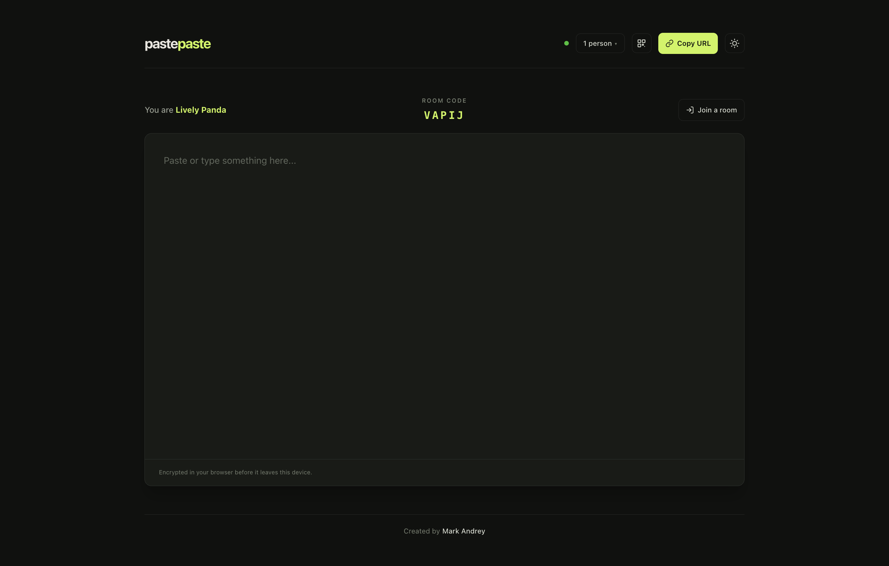

# Pastepaste

Temporary, end-to-end encrypted text sharing between devices in the same room.



## Monorepo layout

- `apps/web` — React, TypeScript, Vite, and Tailwind CSS frontend
- `apps/server` — ASP.NET Core minimal API and SignalR backend

## Web (`apps/web`)

### Local development

```bash
cd apps/web
npm install
npm run dev
```

The frontend uses `http://localhost:8080` by default. Copy `.env.example` to `.env.local` if a different backend URL is needed.

### Commands

```bash
npm run build    # tsc -b && vite build
npm run lint     # oxlint
```

## Server (`apps/server`)

### Local development

```bash
cd apps/server
dotnet run --urls http://localhost:8080
```

`dotnet run` does not hot-reload. Restart the server process (or use `dotnet watch run`) after backend changes.

### Docker

Build and push the API image to Docker Hub:

```bash
docker buildx build \
  --platform linux/amd64,linux/arm64 \
  -t andreycruz16/pastepaste-api:latest \
  -t andreycruz16/pastepaste-api:$(git rev-parse --short HEAD) \
  --push .
```

And to GitHub Container Registry (use your GitHub PAT as the password):

```bash
docker login ghcr.io -u andreycruz16

docker buildx build \
  --platform linux/amd64,linux/arm64 \
  -t ghcr.io/andreycruz16/pastepaste-api:latest \
  -t ghcr.io/andreycruz16/pastepaste-api:$(git rev-parse --short HEAD) \
  --push .
```

## Static websites

- Vercel: https://pastepaste.vercel.app
- Cloudflare Workers: https://pastepaste.madc.workers.dev
- Azure Static Web Apps: https://calm-pebble-08bf65c00.7.azurestaticapps.net

## Architecture

- AES-GCM encryption in the browser
- In-memory room state; no clipboard text is persisted
- Docker deployment target for Azure Container Apps

Rooms disappear when the last connected device leaves or the backend restarts. Five-character room codes are convenient for the alpha but are not strong encryption secrets.

## License

[MIT](LICENSE)
